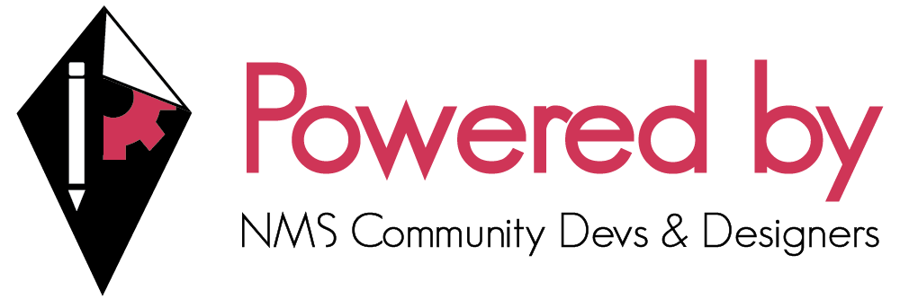

# About
The NMS community is varied, many different play styles and community rivalry have caused us all to get a bit separated. So hopefully the more initiaves that exist, that try and group us all together or link/connect us together, the closer we all can be in this large Galaxy.

## Supported Projects
List of projects supported by the NMSCD (ordered by recency of development efforts):
- \[2021-10-1\] [nms-archive](https://github.com/NMSCD/nms-archive)
  - [Lenni009](https://github.com/Lenni009)
- \[2021-04-23\] [NMS Color Parser](https://nmscd.github.io/nmscolorparser/)
  - [rogerhnn](https://github.com/rogerhnn)
- \[2020-05-15] [Portal Repository](https://portalrepository.com/) 
  - [AtmoVantage](https://github.com/atmovantage)
- \[2020-04-08\] [No Man's Sky Universal Font](https://github.com/NMSCD/No-Mans-Sky-Universal-Font)
  - [YakuzaSuske](https://github.com/YakuzaSuske)
  - [Blend3rman](https://github.com/Blend3rman)
- \[2020-03-30\] [NMS FAQ Bot](https://github.com/AssistantNMS/nms-faq-bot)
  - [Blend3rman](https://github.com/Blend3rman)
  - [Vapour38](https://github.com/Vapour38)
- \[2020-03-30\] [Assistant for No Man's Sky](https://nmsassistant.com)
  - [Khaoz-Topsy](https://github.com/Khaoz-Topsy)
  - [Blend3rman](https://github.com/Blend3rman)
  - [Vapour38](https://github.com/Vapour38)

## How to join?
Join the [NMSCD Discord Server](https://discord.gg/PvpAteKjXU) and tag Admins with a link to your project's Github repo. Projects big and small are welcome, you don't need to be a coding genius like [Khaoz-Topsy](https://github.com/Khaoz-Topsy) to be part of the NMSCD 😛

Being part of the Supported projects allows use of our banners and badges below:

Banner designed by [Sphynxcolt](https://github.com/Sphynxcolt) and [LionessLilo](https://github.com/LionessLilo)

Badges: 
- 
- 

Badges (For The Badge style): 
- 
- 
